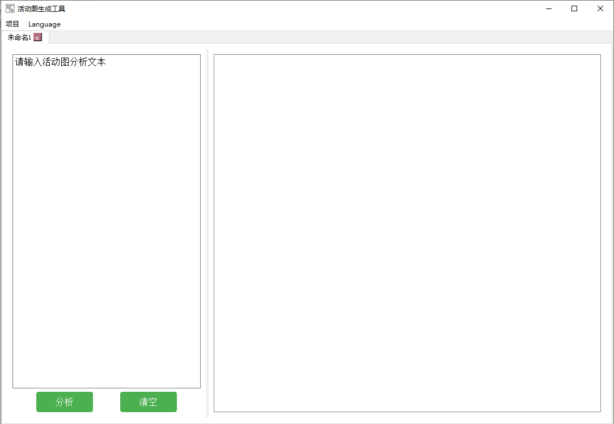
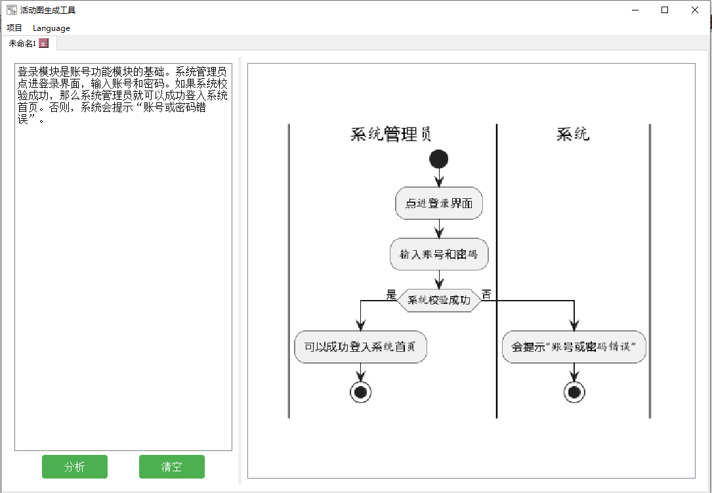
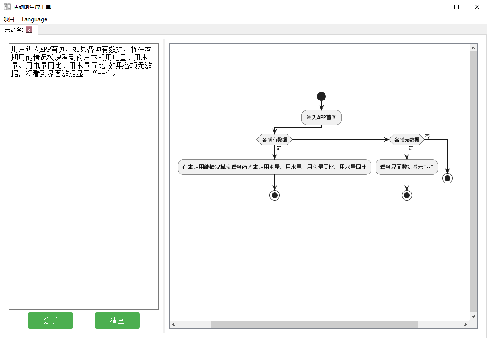
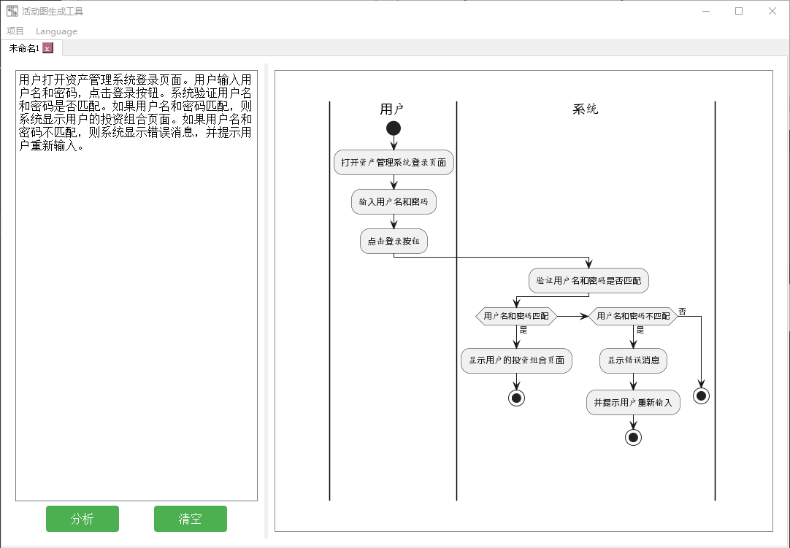
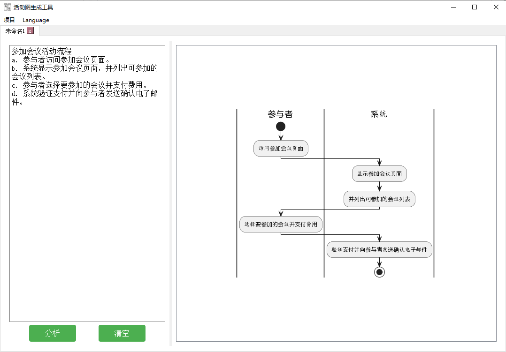
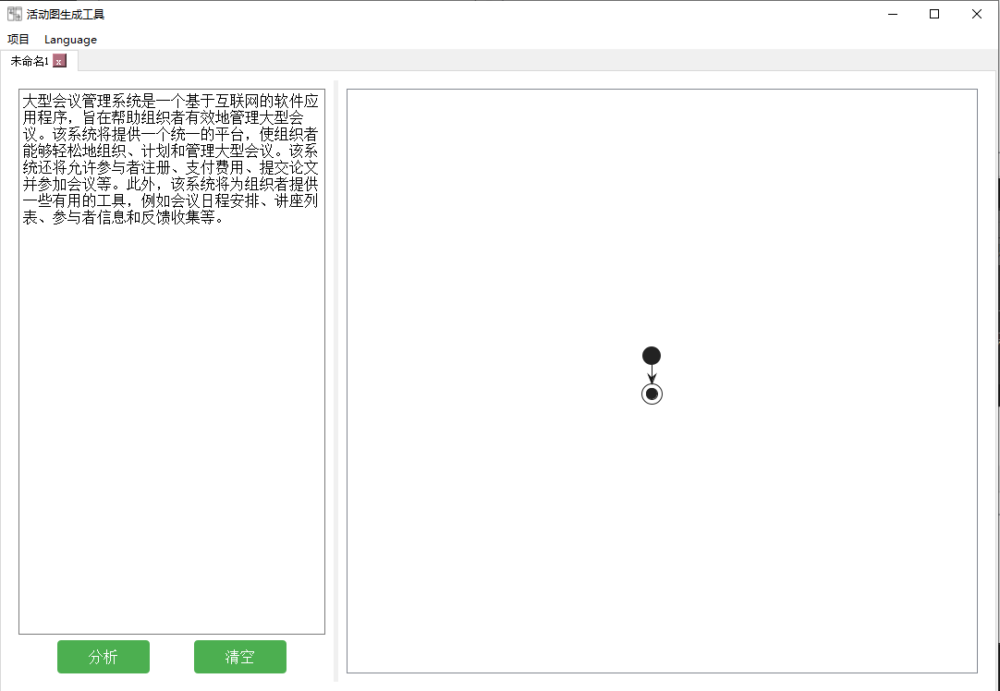

### 安装环境

bert4keras
tensorflow == 2.2.0
keras == 2.3.1
plantuml
graphviz

### 执行命令，启动程序

```
python mainWindow.py
```

新建项目：



输入需要分析的文本，即可生成对应的活动图：

```
登录模块是账号功能模块的基础。系统管理员点进登录界面，输入账号和密码。如果系统校验成功，那么系统管理员就可以成功登入系统首页。否则，系统会提示“账号或密码错误”。
```



```
用户进入APP首页，如果各项有数据，将在本期用能情况模块看到商户本期用电量、用水量、用电量同比、用水量同比;如果各项无数据，将看到界面数据显示“--”。
```



```
用户打开资产管理系统登录页面。用户输入用户名和密码，点击登录按钮。系统验证用户名和密码是否匹配。如果用户名和密码匹配，则系统显示用户的投资组合页面。如果用户名和密码不匹配，则系统显示错误消息，并提示用户重新输入。
```



```
参加会议活动流程
a. 参与者访问参加会议页面。
b. 系统显示参加会议页面，并列出可参加的会议列表。
c. 参与者选择要参加的会议并支付费用。
d. 系统验证支付并向参与者发送确认电子邮件。
```



```
大型会议管理系统是一个基于互联网的软件应用程序，旨在帮助组织者有效地管理大型会议。该系统将提供一个统一的平台，使组织者能够轻松地组织、计划和管理大型会议。该系统还将允许参与者注册、支付费用、提交论文并参加会议等。此外，该系统将为组织者提供一些有用的工具，例如会议日程安排、讲座列表、参与者信息和反馈收集等。
```


