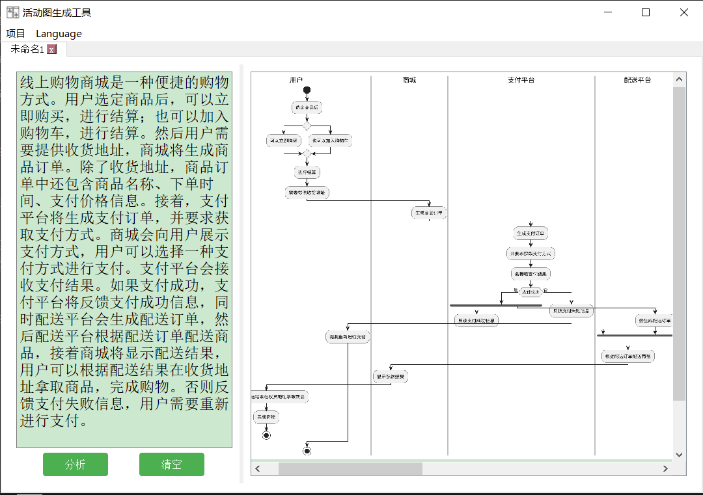

### 安装环境

bert4keras
tensorflow == 2.2.0
keras == 2.3.1
plantuml
graphviz

### 执行命令，启动程序

```
python mainWindow.py
```

新建项目：


输入需要分析的文本，即可生成对应的活动图：

```
教师可以通过本功能参与会议活动。教师访问参加会议页面。系统显示可参加会议的列表。会议列表包含会议时间、会议地点、主讲人信息。教师选择要参加的会议，支付参会费用。系统显示支付情况，同时向教师发送电子邮件进行参会信息确认。
```


```
用户启动撤回安置申请程序。用户输入学生编号。用户提交撤销申请。用户输入卡号文件。
```


```
首先，我们使用采购申请表申请材料。如果采购部门有现有的供应商，那么采购部门就会根据所申请的材料种类确定现有的供应商，否则采购部门就会向潜在的供应商招标，并对他们的投标进行评估，以确定最佳价值。然后，采购部门订购所需的材料。
```


```
当客户从选项菜单中选择交易类型时，自动取款机就会启动交易。自动取款机将要求客户提供适当的详细信息（如涉及的账户、金额）。然后，自动取款机将客户卡上的信息和客户输入的 PIN 码发送给银行。如果银行报告客户的 PIN 码有效，银行将批准交易，自动取款机执行完成交易所需的任何步骤（如发放现金或接受信封），然后打印收据。然后自动取款机将会询问客户是否希望进行另一笔交易。如果银行报告客户的 PIN 码无效，自动取款机将执行 PIN 码无效扩展，然后尝试继续交易。如果PIN码无效次数过多，将扣留客户的卡，终止交易，客户将无法选择再次交易。如果银行客户取消交易，或因PIN码无效次数过多以外的原因导致交易失败，自动取款机将通过屏幕告知客户交易失败的原因，然后询问客户是否希望进行另一笔交易。客户可按“取消”键取消交易，具体操作如下。所有发给银行的信息和回复都会被记录在自动取款机的日志中。
```


```
线上购物商城是一种便捷的购物方式。用户选定商品后，可以立即购买，进行结算；也可以加入购物车，进行结算。然后用户需要提供收货地址，商城将生成商品订单。除了收货地址，商品订单中还包含商品名称、下单时间、支付价格信息。接着，支付平台将生成支付订单，并要求获取支付方式。商城会向用户展示支付方式，用户可以选择一种支付方式进行支付。支付平台会接收支付结果。如果支付成功，支付平台将反馈支付成功信息，同时配送平台会生成配送订单，然后配送平台根据配送订单配送商品，接着商城将显示配送结果，用户可以根据配送结果在收货地址拿取商品，完成购物。否则反馈支付失败信息，用户需要重新进行支付。
```


